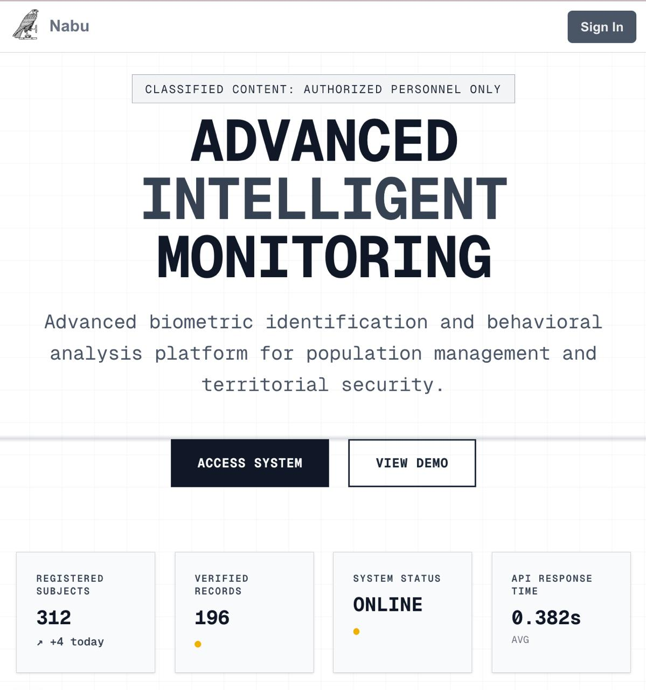

# NabuAya Archive [*//*]

```markdown 
# 🚀 Brief Description

> A fullstack registry and activity logging system integrating facial recognition, demographic data management, and secure API-based retrieval. Built with FastAPI, MongoDB, and a Next.js frontend, the application captures and stores facial encodings alongside personal identifiers such as name, date of birth, and address. Features include authenticated data access, CRUD operations, and facial match-based querying for demographic insights and activity tracking.


---

## ✨ Features

- 📤 Upload `.jpg/.jpeg` images through a clean HTML interface  
- ⚙️ Backend powered by FastAPI with modern async handling  
- 🖼️ Real-time image preview after successful upload  
- 🔐 User login with JWT-based authentication  
- 🌐 CORS-enabled for smooth dev-side requests  
- 🗂️ Static file serving via `StaticFiles` mount  

---

## 🧠 Learning Objectives

This project was built to explore:

- ✅ FastAPI routing with `UploadFile`  
- ✅ Handling and saving files server-side  
- ✅ Serving uploaded content dynamically  
- ✅ Implementing CORS middleware  
- ✅ JavaScript `fetch()` with `FormData`  
- ✅ Implementing secure login using JWT, JS cookies, and Auth Context in Next.js  

---


## 🖥️ Tech Stack

| Layer      | Tech        |
|------------|-------------|
| Backend    | FastAPI     |
| Frontend   | Nextjs, tailwindcss |
| Server     | Uvicorn     |

---


---
```
## ⚠️ Dev Notes

- `allow_origins=["*"]` is used for **development only** – restrict this in production.
- Image saving path is currently hardcoded – adjust for your OS/environment as needed.

---

## 📸 Preview before implementation of future ideas

Here’s what it looks like in action:


## Preview after the implementation of future ideas and database integration



---

## 🪟 Subject Detail Modal

- When a user clicks on a subject's preview card, a modal pops up displaying detailed subject information. This enhances the user experience by avoiding full page reloads and maintaining context within the current view. The modal is dynamically populated using data fetched from the backend and can be easily extended to include more fields (e.g., facial encoding status, address, etc.).


---


---

## 🔐 Login and Authentication


The app now includes login and authentication features using **JWT**, **JS cookies**, and an **Auth Context Provider** in Next.js.

- **JWT (JSON Web Token)**: Issued by the FastAPI backend upon successful login. It securely encodes user identity and roles and is used to authorize protected routes.
- **JS Cookies**: The JWT token is stored in a secure, HTTP-only cookie on the client side, preventing access by JavaScript and reducing XSS risk.
- **Auth Context Provider (Next.js)**: A global context manages user state across the app. It reads the JWT from cookies, verifies it, and makes user data available throughout the app for conditional rendering, access control, and session handling.

This setup allows seamless and secure user login/logout with persistent authentication state.

---

## 🧬 Future Ideas
[x] = completed

- 🧾 expand form to include full name, dob, image [x]
- ☁️ Integrate a database to upload the formdata [x]
- Integrate CRUD capabalities [x]
- Encode faceial landmarks upon submit [x]
- Reference one collection item inside another [x]
- Authentication, cookies, and jwt implementation [x]
- Build landing page []
- Add header component []
- Create route-based page layout []
- Set up centralized state management []
- Add light/dark mode toggle []
- Integrate WebSockets for real-time facial recognition []
- Develop <CaptureImage /> component for live video and distance comparison []
- Develop <SubjectDetails /> component to display extended subject data []


## Bonus Features
user input: user input now inludes sex and address<br>

card: now displays sex and address<br>

Facial Encoding Extraction:
A dynamic face encoding system was integrated into the subject registration workflow. Upon submission of a new subject via a POST request—including an uploaded facial image—the image is processed using the face_recognition library. Facial encodings (128-dimensional face embeddings) are extracted and stored in a separate MongoDB encodings collection. Each encoding is linked to the corresponding subject via the subject's MongoDB _id, enabling efficient face lookup, matching, and identity verification across the system. The process is fully asynchronous and encapsulated in a reusable helper function.
<br>

*screenshots:* <br>

Subject Data: <br>

<br>
Encodings Data:<br>


---


---

```

