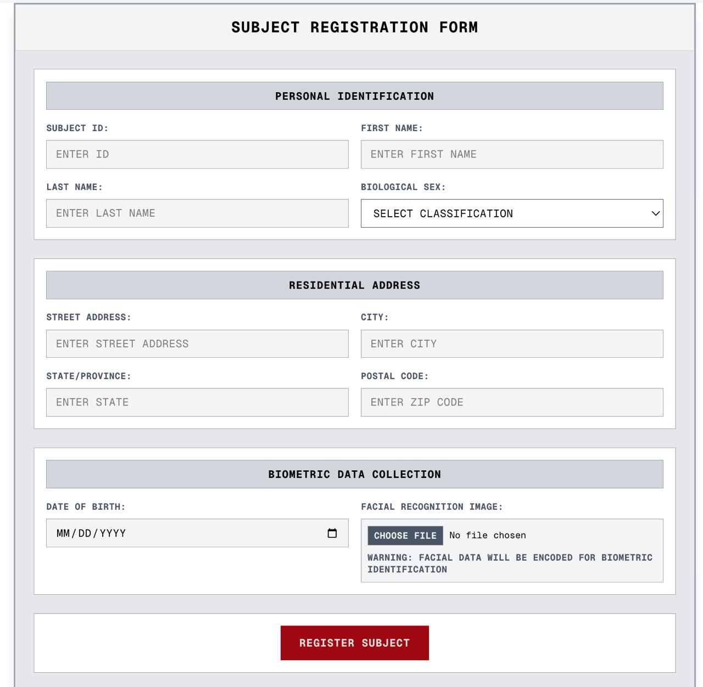
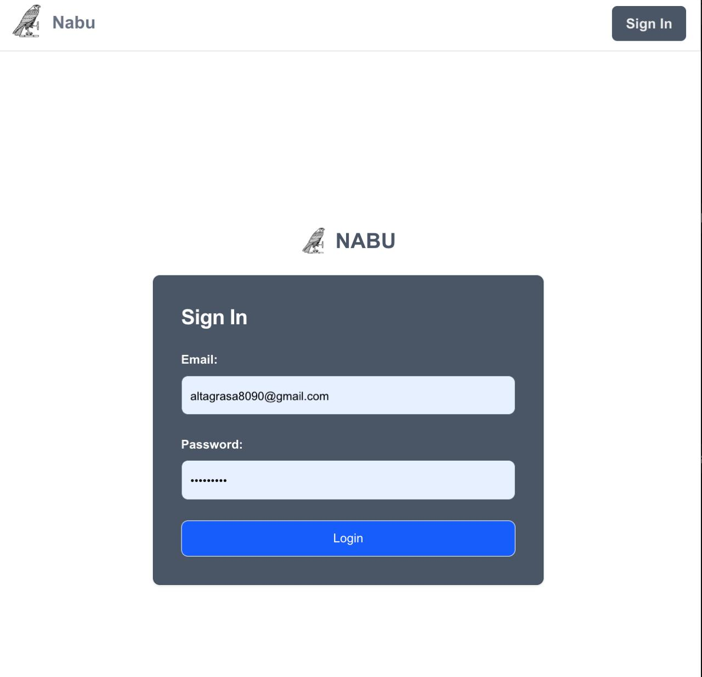

# Nabu Archive

     

> **Learning Project**: A comprehensive fullstack registry and activity logging system demonstrating facial recognition, demographic data management, and secure API-based retrieval. Built to explore modern web development, computer vision integration, and authentication patterns.

## 🎯 Project Overview

This project serves as a practical implementation for learning advanced fullstack development concepts:
- **Facial Recognition Systems** using computer vision libraries
- **Modern Authentication** with JWT and secure cookie management
- **Fullstack Integration** between FastAPI and Next.js
- **NoSQL Database Management** with MongoDB
- **Real-time Processing** and WebSocket integration
- **Secure File Upload** and static file serving

The application captures and stores facial encodings alongside personal identifiers, providing authenticated data access, CRUD operations, and facial match-based querying for demographic insights and activity tracking.

## 🏗️ Architecture

```
nabu-archive/
├── backend/
│   ├── main.py                 # FastAPI application and route handlers
│   ├── auth/                   # JWT authentication logic
│   ├── models/                 # MongoDB document schemas
│   ├── services/               # Business logic and face recognition
│   └── uploads/                # Static file storage
├── frontend/
│   ├── pages/                  # Next.js page components
│   ├── components/             # Reusable React components
│   ├── context/                # Authentication context provider
│   ├── hooks/                  # Custom React hooks
│   └── styles/                 # Tailwind CSS configurations
└── screenshots/                # Documentation assets
```

## 🚀 Features

### Core Functionality
- **Subject Registration**: Complete demographic data capture with image upload
- **Facial Recognition**: 128-dimensional face encoding extraction and storage
- **Authentication System**: JWT-based secure login with HTTP-only cookies
- **CRUD Operations**: Full data management capabilities
- **Real-time Processing**: WebSocket integration for live facial recognition
- **Responsive UI**: Modern interface with Tailwind CSS

### Advanced Features
- **Live Camera Capture**: Real-time video processing with distance comparison
- **Subject Detail Modals**: Enhanced UX with contextual data display
- **Facial Match Querying**: Identity verification and demographic insights
- **Activity Logging**: Comprehensive tracking and audit trails
- **Dynamic File Serving**: Secure image storage and retrieval

## 🛠️ Technology Stack

| Component | Technology | Purpose |
|-----------|------------|---------|
| **Backend Framework** | FastAPI | High-performance async API with automatic OpenAPI docs |
| **Frontend Framework** | Next.js 13+ | React-based SSR/SSG with app router |
| **Database** | MongoDB | Document-based storage for flexible schema design |
| **Styling** | Tailwind CSS | Utility-first CSS framework |
| **Authentication** | JWT + HTTP Cookies | Secure token-based authentication |
| **Computer Vision** | face_recognition | Facial encoding and recognition processing |
| **State Management** | React Context API | Centralized authentication state |
| **File Upload** | FastAPI UploadFile | Secure multipart file handling |
| **Real-time Communication** | WebSockets | Live facial recognition updates |

## 📋 Prerequisites

- Node.js (16.0+)
- Python (3.8+)
- MongoDB (4.4+)
- OpenCV dependencies
- Modern web browser with camera access

## ⚡ Quick Start

### Backend Setup

1. **Clone and navigate to backend**
   ```bash
   git clone <repository-url>
   cd nabu-archive/backend
   ```

2. **Install Python dependencies**
   ```bash
   pip install fastapi uvicorn python-multipart face_recognition pymongo python-jose[cryptography] python-dotenv
   ```

3. **Configure environment variables**
   ```bash
   # Create .env file
   MONGODB_URI=mongodb://localhost:27017/nabu_archive
   JWT_SECRET_KEY=your-secret-key-here
   JWT_ALGORITHM=HS256
   ```

4. **Start the FastAPI server**
   ```bash
   uvicorn main:app --reload --port 8000
   ```

### Frontend Setup

1. **Navigate to frontend directory**
   ```bash
   cd ../frontend
   ```

2. **Install Node.js dependencies**
   ```bash
   npm install
   # or
   yarn install
   ```

3. **Configure environment variables**
   ```bash
   # Create .env.local
   NEXT_PUBLIC_API_URL=http://localhost:8000
   ```

4. **Start the Next.js development server**
   ```bash
   npm run dev
   # or
   yarn dev
   ```

5. **Access the application**
   - Frontend: http://localhost:3000
   - Backend API: http://localhost:8000
   - API Documentation: http://localhost:8000/docs

## 🔌 API Endpoints

### Authentication
| Method | Endpoint | Description | Authentication |
|--------|----------|-------------|----------------|
| `POST` | `/auth/login` | User authentication | Public |
| `POST` | `/auth/logout` | Session termination | Required |
| `GET` | `/auth/verify` | Token validation | Required |

### Subject Management
| Method | Endpoint | Description | Authentication |
|--------|----------|-------------|----------------|
| `POST` | `/subjects/` | Create new subject with image | Required |
| `GET` | `/subjects/` | Retrieve all subjects | Required |
| `GET` | `/subjects/{id}` | Get specific subject | Required |
| `PUT` | `/subjects/{id}` | Update subject data | Required |
| `DELETE` | `/subjects/{id}` | Remove subject | Required |

### Facial Recognition
| Method | Endpoint | Description | Authentication |
|--------|----------|-------------|----------------|
| `POST` | `/recognition/match` | Find matching faces | Required |
| `GET` | `/encodings/{subject_id}` | Retrieve face encodings | Required |
| `POST` | `/recognition/live` | Real-time face detection | Required |

## 🗄️ Database Schema

### Subjects Collection
```javascript
{
  "_id": ObjectId,
  "name": String,
  "date_of_birth": Date,
  "sex": String,
  "address": String,
  "image_path": String,
  "created_at": Date,
  "updated_at": Date
}
```

### Encodings Collection
```javascript
{
  "_id": ObjectId,
  "subject_id": ObjectId,
  "encoding": Array[128], // 128-dimensional face embedding
  "confidence": Number,
  "created_at": Date
}
```

## 🔐 Authentication Flow

The application implements a secure authentication system:

1. **Login Process**: User credentials validated against database
2. **JWT Generation**: Server creates signed token with user payload
3. **Secure Storage**: Token stored in HTTP-only cookie (XSS protection)
4. **Context Management**: React Context provides global auth state
5. **Route Protection**: Middleware validates tokens on protected routes
6. **Session Management**: Automatic token refresh and logout handling

### Security Features
- HTTP-only cookies prevent XSS attacks
- CORS configuration for development/production
- JWT token expiration and refresh
- Protected route middleware
- Input validation and sanitization

## 📱 User Interface Components

### Core Components
- **SubjectRegistration**: Multi-field form with image upload
- **SubjectCard**: Preview cards with modal interactions
- **CaptureImage**: Live camera integration with face detection
- **SubjectDetails**: Comprehensive data display modal
- **AuthProvider**: Global authentication state management

### Screenshots

#### Subject Registration Interface


#### Updated Dashboard with Database Integration


#### Subject Detail Modal


#### Authentication Interface


#### Database Collections
**Subject Data:**


**Facial Encodings:**


## 🧬 Facial Recognition Implementation

### Face Encoding Process
1. **Image Upload**: User submits form with facial photograph
2. **Face Detection**: `face_recognition` library identifies facial features
3. **Encoding Generation**: 128-dimensional embedding extraction
4. **Database Storage**: Encodings stored separately with subject reference
5. **Matching Algorithm**: Euclidean distance comparison for identification

### Technical Implementation
```python
# Simplified face encoding workflow
def extract_face_encoding(image_path):
    image = face_recognition.load_image_file(image_path)
    encodings = face_recognition.face_encodings(image)
    return encodings[0] if encodings else None
```

## 📚 Learning Outcomes

This project demonstrates proficiency in:

### Fullstack Development
- Modern React patterns with Next.js 13+ app router
- FastAPI async programming and automatic documentation
- RESTful API design and implementation
- Database integration with NoSQL (MongoDB)

### Computer Vision & AI
- Face recognition library integration
- Image processing and encoding extraction
- Real-time video processing with WebSockets
- Distance-based facial matching algorithms

### Security & Authentication
- JWT token generation and validation
- Secure cookie implementation (HTTP-only)
- CORS configuration and middleware
- Protected route patterns in both frontend and backend

### DevOps & File Management
- Static file serving and upload handling
- Environment-based configuration
- Development vs production security considerations
- Database schema design for complex relationships

## 🚧 Implementation Status

### ✅ Completed Features
- [x] Multi-field subject registration form
- [x] MongoDB database integration
- [x] Full CRUD operations
- [x] Facial encoding extraction and storage
- [x] Collection references and relationships
- [x] JWT authentication with secure cookies
- [x] Responsive landing page design
- [x] Header component and navigation
- [x] Route-based page layouts
- [x] Real-time WebSocket integration
- [x] Live camera capture component
- [x] Subject detail modal system

### 🔄 Future Enhancements
- [ ] Centralized state management (Redux/Zustand)
- [ ] Light/dark mode theme toggle
- [ ] Advanced facial recognition metrics
- [ ] Activity logging and audit trails
- [ ] Export functionality (PDF/CSV)
- [ ] Advanced search and filtering
- [ ] Role-based access control
- [ ] API rate limiting and monitoring

## ⚠️ Security Considerations

**Development vs Production**:
- CORS origins currently set to `["*"]` for development
- Database credentials should use environment variables
- JWT secret keys must be properly secured
- File upload validation needs enhancement
- Rate limiting should be implemented

**Production Recommendations**:
- Implement proper CORS origins
- Add input validation middleware
- Use HTTPS for all communications
- Implement file type and size restrictions
- Add comprehensive error logging
- Consider CDN for static file serving

## 🔧 Environment Configuration

### Backend (.env)
```bash
MONGODB_URI=mongodb://localhost:27017/nabu_archive
JWT_SECRET_KEY=your-super-secure-secret-key
JWT_ALGORITHM=HS256
UPLOAD_DIR=./uploads
CORS_ORIGINS=http://localhost:3000
```

### Frontend (.env.local)
```bash
NEXT_PUBLIC_API_URL=http://localhost:8000
NEXT_PUBLIC_UPLOAD_URL=http://localhost:8000/uploads
```

## 🧪 Testing the Application

### Basic Functionality Tests
```bash
# Test authentication
curl -X POST http://localhost:8000/auth/login \
  -H "Content-Type: application/json" \
  -d '{"username": "test", "password": "test"}'

# Test subject creation
curl -X POST http://localhost:8000/subjects/ \
  -H "Authorization: Bearer <token>" \
  -F "name=John Doe" \
  -F "date_of_birth=1990-01-01" \
  -F "image=@path/to/image.jpg"
```

### Frontend Development
- Navigate through all pages without authentication
- Test login/logout functionality
- Upload subject with image and verify encoding generation
- Test real-time camera features
- Verify modal interactions and data display

## 📖 References

- [FastAPI Documentation](https://fastapi.tiangolo.com/)
- [Next.js Documentation](https://nextjs.org/docs)
- [MongoDB Documentation](https://docs.mongodb.com/)
- [face_recognition Library](https://github.com/ageitgey/face_recognition)
- [JWT.io](https://jwt.io/) - JWT debugging and information
- [Tailwind CSS Documentation](https://tailwindcss.com/docs)

---

*This project was developed as a comprehensive learning exercise to explore modern fullstack development, computer vision integration, and secure authentication patterns. It demonstrates practical implementation of complex systems while maintaining focus on clean code architecture and user experience design.*